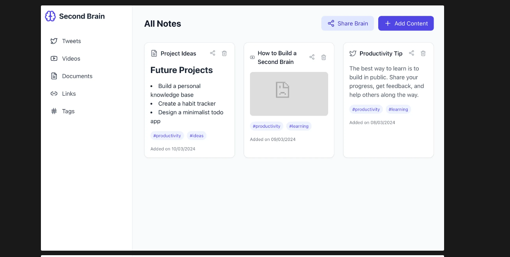
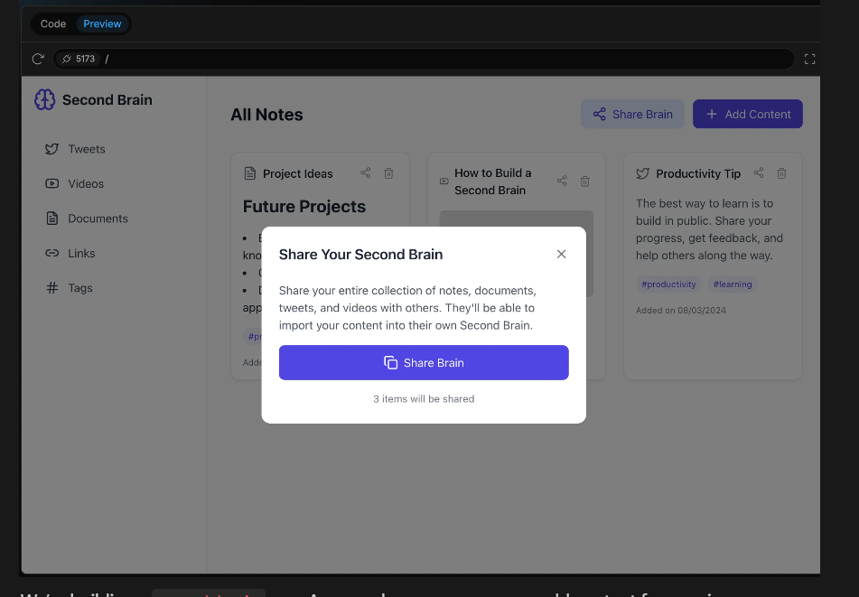

# Second Brain App


## Overview

The Second Brain App is a TypeScript-based application designed to help users organize and manage their knowledge effectively. It consists of a frontend (brainly-frontend) and backend (brainly-backend) architecture.

## Features

- Intuitive dashboard for knowledge management
- Content creation and organization
- Responsive design for various devices
- API integration between frontend and backend
- TypeScript-based development for type safety

## Installation

### Prerequisites

- Node.js (v16 or higher)
- npm or yarn
- TypeScript

### Steps

1. Clone the repository:
   ```bash
   git clone https://github.com/your-repo/second-brain-app.git
   ```
2. Install dependencies for both frontend and backend:
   ```bash
   cd brainly-frontend
   npm install
   cd ../brainly-backend
   npm install
   ```
3. Configure environment variables:

   - Create `.env` files in both frontend and backend directories
   - Add necessary configurations (API keys, database credentials, etc.)

4. Start the development servers:

   ```bash
   # In frontend directory
   npm run dev

   # In backend directory
   npm start
   ```

## Usage

1. Access the application at `https://second-brain-frontend-nwov.onrender.com`
2. Use the dashboard to create and organize your knowledge
3. Explore different features through the intuitive interface

## Screenshots

### Dashboard View



### Content Management



## Project Structure

```
second-brain-app/
├── brainly-frontend/      # Frontend application
│   ├── src/               # Source files
│   ├── public/             # Static assets
│   └── ...                # Other frontend files
├── brainly-backend/        # Backend application
│   ├── src/                # Source files
│   └── ...                # Other backend files
└── README.MD               # Project documentation
```

## Contributing

Contributions are welcome! Please follow these steps:

1. Fork the repository
2. Create your feature branch (`git checkout -b feature/AmazingFeature`)
3. Commit your changes (`git commit -m 'Add some AmazingFeature'`)
4. Push to the branch (`git push origin feature/AmazingFeature`)
5. Open a Pull Request

## License

This project is licensed under the MIT License - see the LICENSE file for details.
